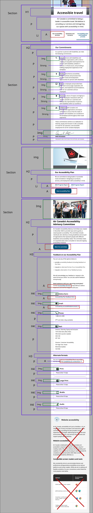
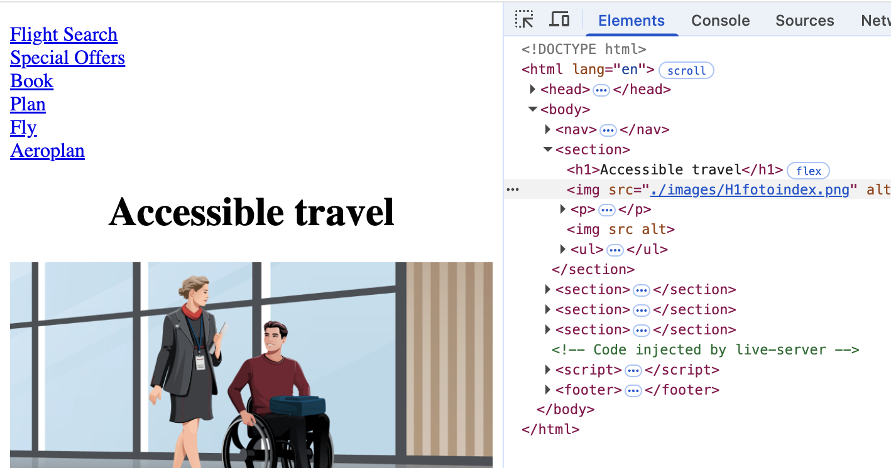

# Procesverslag
Markdown is een simpele manier om HTML te schrijven.  
Markdown cheat cheet: [Hulp bij het schrijven van Markdown](https://github.com/adam-p/markdown-here/wiki/Markdown-Cheatsheet).

Nb. De standaardstructuur en de spartaanse opmaak van de README.md zijn helemaal prima. Het gaat om de inhoud van je procesverslag. Besteedt de tijd voor pracht en praal aan je website.

Nb. Door *open* toe te voegen aan een *details* element kun je deze standaard open zetten. Fijn om dat steeds voor de relevante stuk(ken) te doen.

## Jij

  
uitwerken voor kick-off werkgroep

  ### Auteur:
  Omra Jamshidi

  #### Je startniveau:
  Blauw

  #### Je focus:
  Responsive, hier je focus (kies uit responsive óf surface plane)
 

## Je website

  
uitwerken voor kick-off werkgroep

  ### Je opdracht:
  link naar de website die je gaat namaken óf de naam/omschrijving van je eigen ontwerp

  https://www.aircanada.com/nl/en/aco/home/plan/accessibility.html#/ 

  #### Screenshot(s) van de eerste pagina (small screen): 
  Air Canada accessibility
  

  #### Screenshot(s) van de tweede pagina (small screen):
  Air Canada Business-travel
  
 

## Toegankelijkheidstest 1/2 (week 1)

  

  Tijdens de les heb ik gekeken hoe toegankhelijk de website is. We kregen een WCAG checklist. met behulp van deze checklist heb ik samen met mijn klasgenoot kunnen controleren aan welke punten de website voldoet. de Air Canada maakt gebruik van iconen en heeft een onderscheidt van links en buttons. links die naar een andere pahina gaan wordt ook met behulp vaan een teken/icoon aangegeven. Elke pagina had een eigen titel in een H1, en maakt goed gebruik van h2 en h3 in de pagina. De keyboard focus was duidelijk te zien en het gaf alleen focus op alle links en buttons. de tekst op de telefoon was nogal klein (waarschijnlijk omdat het lange teksten zijn) en er wordt zuinig gebruik gemaakt van witruimt. met zoveel tekst mocht de witruimte wel wat meer zijn. de afbeeldingen hebben geen duidelijke alt, er staat "alt arie-hidden=true" bij elke afbeelding. De website heeft geen light and dark modus. er wordt gebruik gemaakt van zwart wit kleur met wat blauw voor de buttons en links. naast kleur geveen ze ook informatie met andere elementen.

  e werkgroep

  ### Bevindingen
  - Geen dark and light modus
  - h1, h2 en h3 zijn goed gebruikt met één h1 per scherm
  - Weinig witruimte
  - Op kleine schermen is er ook kleine stukken teksten
  - Afbeeldingen hebben geen juiste alt voor de voice overs

## Breakdownschets (week 1)

  
uitwerken na afloop 3e werkgroep

  ### de hele pagina: 
  

  ### dynamisch deel (bijv menu): 
  

  <!-- ### wellicht nog een dynamisch deel (bijv filter): 
   -->

## Voortgang 1 (week 2)

  
uitwerken voor 1e voortgang

  ### Stand van zaken
  hier dit ging goed & dit was lastig (neem ook screenshots op van delen van je website en code)
  Ik ben begonnen met eerst al mijn html in te vullen in de index.html. Dit ging soepel. Ik heb geen lange teksten maar veel korte paragrafen en veel H (h2, H3, H4). Elke keer had ik steeds de nijging om alvast met mijn css te gaan beginnen. zodra ik begon wist ik niet hoe ik moet beginnen. Het voelt alsof ik een blackout heb, want ik herinner me niks meer van css. Later besef ik me dat niet al mijn Html af is, ik moest de footer en alle img erbij toevoegen. In de les hebben we geoefend met de hamburger menu. ik heb dezelfde code van codepen die we hadden geoefend in mijn eigen code verwerkt (ik had nog geen css of js staan) maar hij doet het niet. En de img van de hamburgermenu  is ook niet meer te zien nadat ik de code had ingevuld.
    

  ### Agenda voor meeting
  samen met je groepje opstellen

  | Omra            | Yenthe             |   Arpine             | Laura       |
  
  Omra: Hoe gebruik je  nth-of-type in de css van de beide schermen
  Yenthe: Aria labels en custom properties
  Arpine: Wanneer gebruikje flex en wanneeer grid

  ### Verslag van meeting
  hier na afloop snel de uitkomsten van de meeting vastleggen

  - Navigatie en footer waren buiten de body
  - Main en header waren er niet
  - Sections weg halen en gebruik maken li en artciles
  - Ik had een hele grote section met h2, h3 en h4s. Het werd mij aangeraden   om het in drie sections te doen. Dat is logischer en fijner om mee te werken.
  - Css mapjes waren duidelijk uitgelegd want ik wist niet hoe ik de nth-of-type moest gebruiken voor beide schermen.
  - Iconen gebruiken van svg repo

## Voortgang 2 (week 3)

  
uitwerken voor 2e voortgang

  ### Stand van zaken
  Ik verwerkte alle feedback die ik heb gekregen. Ik had het gevoel dat mijn html toch niet helemaal klopt met al die lists erbij toegevoegd. tijdens de les vroeg ik om hulp en werd ik ermee geholpen. De lists is uitgelegd en ook voor mijn andere html code werd ik geholpen met hoe ik ze zou moeten typen. Ook ben ik geholpen met de css. Thuis heb ik alle html code goed gezet en begon met de css. 

  Met de css moest ik vooral veel elementen gaan positioneren. Ik was een beetje geholpen in de les hiermee. Ik maakte gebruik van flex-directions voor mijn derde sectie. Het lukte mij niet om de h1 en p eronder, onder de image te zetten en een witte vlak erachter te zetten. ik heb chatgpt gevraagd om te helpen hiermee. Ik kreeg een code en zette die in mijn css. ik keek welke elementen ik belangrijk vond en welke onnodig. de stukken css die niks deden of die niet goed van gebruik waren heb ik verwijderen van de chatgpt code. En heb zelf de formaten aangepast ervan zodat het zou kloppen. De footer heb ik donker gemaakt en alle html ervan volledig toegevoegd. 
  
  de menu button werkte niet 

  voor het gesprek ahd ik de vraag - Hoe verander ik de fonts van een 1 ul/li/ a element en niet van alle andere? Dit is mij gelukt op te lossen voor het gesprek. 

  ### Agenda voor meeting
  samen met je groepje opstellen

  | student 1      | student 2          | student 3    | student 4        |
  | ---            | ---                | ---          | ---              |
  | dit bespreken  | en dit             | en ik dit    | en dan ik dat    |
  | en dat ook nog | dit als er tijd is | nog een punt | dit wil ik zeker |
  | ...            | ...                | ...          | ...              |

Omra: 
- Kan ik een article in de footer sections zetten?
- hoe krijg ik de h2 van sectie vier onder de image
- Op mobile is section vijf een hele blok, maar als je hem groter maakt zijn het      aparte blokken. Moet dit met css worden veranderen of html?
- Hoe verander je de lettertype van de a in adress, de font is wel geselcteerd met de a maar het wordt niet gewizjigd. (adress weg doen?)
 
 Yenthe:
-

 Laura:
- Ik heb meerdere divs gebruikt in mijn html omdat ik anders het niet goed gepositioneerd kreeg met de opmaakt van bv flex, mag dit dan wel?
- Hoe kan ik mijn header met bepaalde breedte de svg in het menu wel en niet tonen. mag dit met display none?
- Bij mijn spotify section is er nog een kruisje die het sluit, moet dit werken? Hoe krijg ik deze rechts in de hoek gepositioneerd?
- Ik heb pijltjes in mijn carousel nodig maar die krijg ik niet gepositioneerd, hoe doe ik dit?

Arpine:
-

  ### Verslag van meeting
  hier na afloop snel de uitkomsten van de meeting vastleggen

  - punt 1
  - punt 2
  - nog een punt
- ...

## Toegankelijkheidstest 2/2 (week 4)

  
uitwerken na test in 9e werkgroep

  ### Bevindingen
  Lijst met je bevindingen die in de test naar voren kwamen (geef ook aan wat er verbeterd is):

## Voortgang 3 (week 4)

  
uitwerken voor 3e voortgang

  ### Stand van zaken
  hier dit ging goed & dit was lastig (neem ook screenshots op van delen van je website en code)

  ### Agenda voor meeting
  samen met je groepje opstellen

  | student 1      | student 2          | student 3    | student 4        |
  | ---            | ---                | ---          | ---              |
  | dit bespreken  | en dit             | en ik dit    | en dan ik dat    |
  | en dat ook nog | dit als er tijd is | nog een punt | dit wil ik zeker |
  | ...            | ...                | ...          | ...              |

  ### Verslag van meeting
  hier na afloop snel de uitkomsten van de meeting vastleggen

  - punt 1
  - punt 2
  - nog een punt
  - ...

## Eindgesprek (week 5)

  
uitwerken voor eindgesprek

  ### Je uitkomst - karakteristiek screenshots:
  

  ### Dit ging goed/Heb ik geleerd: 
  Korte omschrijving met plaatjes

  

  ### Dit was lastig/Is niet gelukt:
  Korte omschrijving met plaatjes

  

## Bronnenlijst

  
continu bijhouden terwijl je werkt

  Nb. Wees specifiek ('css-tricks' als bron is bijv. niet specifiek genoeg). 
  Nb. ChatGpT en andere AI horen er ook bij.
  Nb. Vermeld de bronnen ook in je code.

  1. bron 1
  2. bron 2
  3. ...

