# Procesverslag
Markdown is een simpele manier om HTML te schrijven.  
Markdown cheat cheet: [Hulp bij het schrijven van Markdown](https://github.com/adam-p/markdown-here/wiki/Markdown-Cheatsheet).

Nb. De standaardstructuur en de spartaanse opmaak van de README.md zijn helemaal prima. Het gaat om de inhoud van je procesverslag. Besteedt de tijd voor pracht en praal aan je website.

Nb. Door *open* toe te voegen aan een *details* element kun je deze standaard open zetten. Fijn om dat steeds voor de relevante stuk(ken) te doen.

## Jij

  
uitwerken voor kick-off werkgroep

  ### Auteur:
  Omra Jamshidi

  #### Je startniveau:
  Blauw

  #### Je focus:
  Responsive, hier je focus (kies uit responsive óf surface plane)
 

## Je website

  
uitwerken voor kick-off werkgroep

  ### Je opdracht:
  link naar de website die je gaat namaken óf de naam/omschrijving van je eigen ontwerp

  https://www.aircanada.com/nl/en/aco/home/plan/accessibility.html#/ 

  #### Screenshot(s) van de eerste pagina (small screen): 
  Air Canada accessibility
  

  #### Screenshot(s) van de tweede pagina (small screen):
  Air Canada Business-travel
  
 

## Toegankelijkheidstest 1/2 (week 1)

  

  Tijdens de les heb ik gekeken hoe toegankhelijk de website is. We kregen een WCAG checklist. met behulp van deze checklist heb ik samen met mijn klasgenoot kunnen controleren aan welke punten de website voldoet. de Air Canada maakt gebruik van iconen en heeft een onderscheidt van links en buttons. links die naar een andere pahina gaan wordt ook met behulp vaan een teken/icoon aangegeven. Elke pagina had een eigen titel in een H1, en maakt goed gebruik van h2 en h3 in de pagina. De keyboard focus was duidelijk te zien en het gaf alleen focus op alle links en buttons. de tekst op de telefoon was nogal klein (waarschijnlijk omdat het lange teksten zijn) en er wordt zuinig gebruik gemaakt van witruimt. met zoveel tekst mocht de witruimte wel wat meer zijn. de afbeeldingen hebben geen duidelijke alt, er staat "alt arie-hidden=true" bij elke afbeelding. De website heeft geen light and dark modus. er wordt gebruik gemaakt van zwart wit kleur met wat blauw voor de buttons en links. naast kleur geveen ze ook informatie met andere elementen.

  e werkgroep

  ### Bevindingen
  - Geen dark and light modus
  - h1, h2 en h3 zijn goed gebruikt met één h1 per scherm
  - Weinig witruimte
  - Op kleine schermen is er ook kleine stukken teksten
  - Afbeeldingen hebben geen juiste alt voor de voice overs
  - Ze gebruiken te veel divs

## Breakdownschets (week 1)

  
uitwerken na afloop 3e werkgroep

  ### de hele pagina: 
  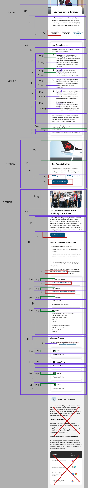

  ### dynamisch deel (bijv menu): 
  

Na het eerste groepsgesprek werd mijn html gecontroleerd. Er werd mijn verteldt dat de laatste sectie op mijn eerste pagina veelste lang was en het beter is als ik dat inkort. Dit heb ik ook gedaan. 
 
 nieuwe breakdown schets
  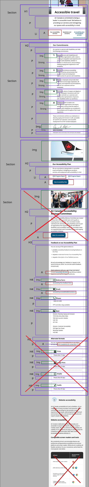

## Voortgang 1 (week 2)

  
uitwerken voor 1e voortgang

  ### Stand van zaken
  hier dit ging goed & dit was lastig (neem ook screenshots op van delen van je website en code)
  Ik ben begonnen met eerst al mijn html in te vullen in de index.html. Dit ging soepel. Ik heb geen lange teksten maar veel korte paragrafen en veel H (h2, H3, H4). Elke keer had ik steeds de nijging om alvast met mijn css te gaan beginnen. zodra ik begon wist ik niet hoe ik moet beginnen. Het voelt alsof ik een blackout heb, want ik herinner me niks meer van css. Later besef ik me dat niet al mijn Html af is, ik moest de footer en alle img erbij toevoegen. In de les hebben we geoefend met de hamburger menu. ik heb dezelfde code van codepen die we hadden geoefend in mijn eigen code verwerkt (ik had nog geen css of js staan) maar hij doet het niet. En de img van de hamburgermenu  is ook niet meer te zien nadat ik de code had ingevuld.
    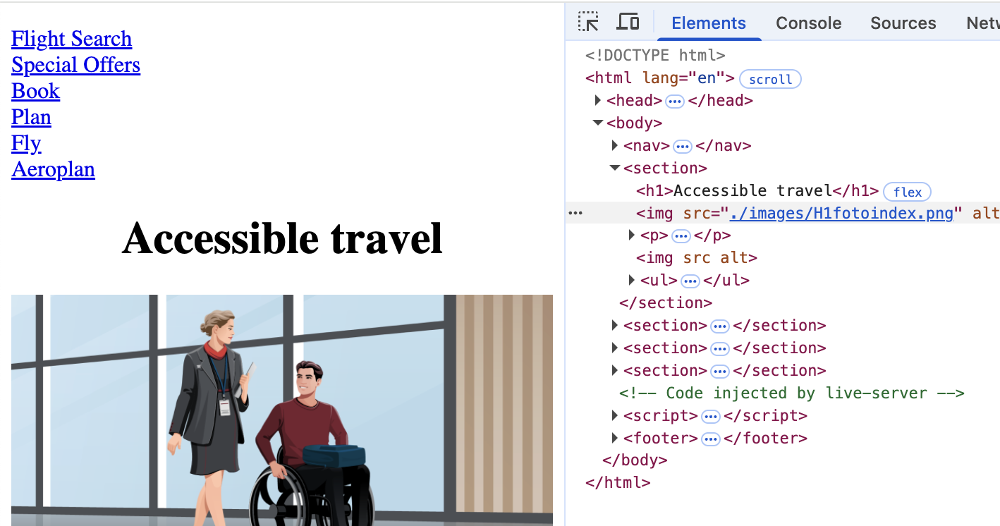

Ik werd geholpen met grid en het positioneren van mijn footer. voor mijn footer mocht ik 1 div gebruiken. de tekeningen hadden mij veel geholpen. elke keer als ik het even vergat hoe het zat en met grid pakte ik de tkeeningen erbij.

  ### Agenda voor meeting
  samen met je groepje opstellen
  
Omra:
- Hoe gebruik je  nth-of-type in de css van de beide schermen

Yenthe: 
- Aria labels en custom properties

Arpine: 
- Wanneer gebruikje flex en wanneeer grid

laura:
- Niet aanwezig

  ### Verslag van meeting
  hier na afloop snel de uitkomsten van de meeting vastleggen

  - Navigatie en footer waren buiten de body
  - Main en header waren er niet
  - Sections weg halen en gebruik maken li en artciles
  - Ik had een hele grote section met h2, h3 en h4s. Het werd mij aangeraden   om het in drie sections te doen. Dat is logischer en fijner om mee te werken.
  - Css mapjes waren duidelijk uitgelegd want ik wist niet hoe ik de nth-of-type moest gebruiken voor beide schermen.
  - Iconen gebruiken van svg repo

## Voortgang 2 (week 3)

  
uitwerken voor 2e voortgang

  ### Stand van zaken
  Ik verwerkte alle feedback die ik heb gekregen. Ik had het gevoel dat mijn html toch niet helemaal klopt met al die lists erbij toegevoegd. tijdens de les vroeg ik om hulp en werd ik ermee geholpen. De lists is uitgelegd en ook voor mijn andere html code werd ik geholpen met hoe ik ze zou moeten typen. Ook ben ik geholpen met de css. Thuis heb ik alle html code goed gezet en begon met de css. 

  Met de css moest ik vooral veel elementen gaan positioneren. Ik was een beetje geholpen in de les hiermee. Ik maakte gebruik van flex-directions voor mijn derde sectie. Het lukte mij niet om de h1 en p eronder, onder de image te zetten en een witte vlak erachter te zetten. ik heb chatgpt gevraagd om te helpen hiermee. Ik kreeg een code en zette die in mijn css. ik keek welke elementen ik belangrijk vond en welke onnodig. de stukken css die niks deden of die niet goed van gebruik waren heb ik verwijderen van de chatgpt code. En heb zelf de formaten aangepast ervan zodat het zou kloppen. De footer heb ik donker gemaakt en alle html ervan volledig toegevoegd. 
  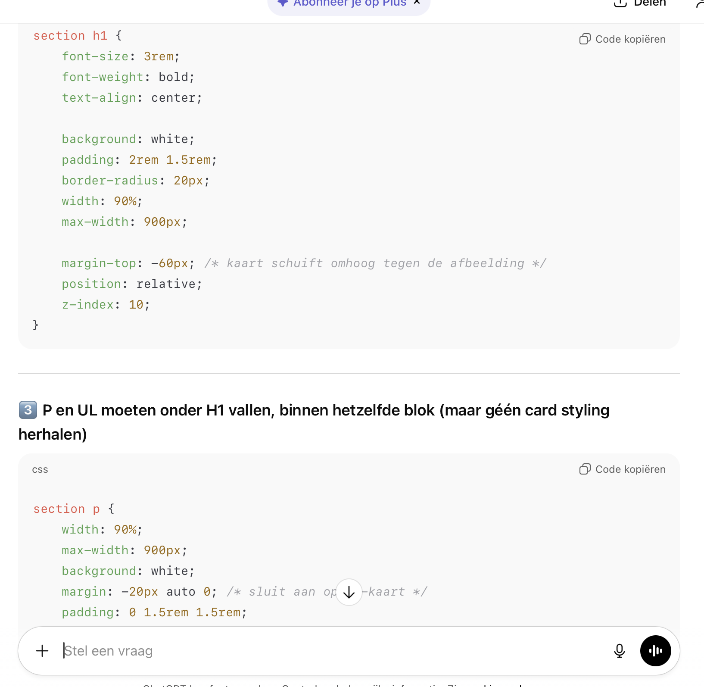
  de menu button werkte niet 

  voor het gesprek ahd ik de vraag - Hoe verander ik de fonts van een 1 ul/li/ a element en niet van alle andere? Dit is mij gelukt op te lossen voor het gesprek. 

  ### Agenda voor meeting

Omra: 
- Kan ik een article in de footer sections zetten?
- hoe krijg ik de h2 van sectie vier onder de image
- Op mobile is section vijf een hele blok, maar als je hem groter maakt zijn het      aparte blokken. Moet dit met css worden veranderen of html?
- Hoe verander je de lettertype van de a in adress, de font is wel geselcteerd met de a maar het wordt niet gewijzigd. (adress weg doen?)
 
 Yenthe:
- Hoe kunnen mijn afbeeldingen mee schalen zodat ze langer worden in de lengte?
- Hoe positioneren met display grid

 Laura:
- Ik heb meerdere divs gebruikt in mijn html omdat ik anders het niet goed gepositioneerd kreeg met de opmaakt van bv flex, mag dit dan wel?
- Hoe kan ik mijn header met bepaalde breedte de svg in het menu wel en niet tonen. mag dit met display none?
- Bij mijn spotify section is er nog een kruisje die het sluit, moet dit werken? Hoe krijg ik deze rechts in de hoek gepositioneerd?
- Ik heb pijltjes in mijn carousel nodig maar die krijg ik niet gepositioneerd, hoe doe ik dit?

Arpine:
- hoe kan ik ervoor zorgen dat de plaatjes in de carousel dezelfde grootte zijn?
- waarom krijgt de grid een extra column erbij als er niks in zit?
 

voor responsive media en/of clamp, vw,/ grid, grid-template-columns/ 
(aantekeing voormijzelf)

  ### Verslag van meeting
  hier na afloop snel de uitkomsten van de meeting vastleggen

  - Ik heb geleerd hoe ik de @media nu kan gebruiken (had het gebruikt voor mijn articles.)
  - Er werd geholpen met de italic font weg te halen. 
  - Er werd uitgelegd over hoe je twee verschillende foto's van een foto kan gebruiken voor responsive scherm.

De picture dat we bij de groepsgesprek besproken hadden heb ik later ook zelf gebruik. bij de response merkte ik dat de fotos niet lekker gaan. Ik zag in de code dat ze allemaal verschillende formaten ftos hadden gebruikt van 1 foto. Ik vroeg Yenthe voor de picture code en zij had me ermee geholpen en verteld dat het in mijn html moest. Ik had helaas geek aantekeingen gemaakt tijdens dat gesprek dus ik ben blij dat Yenthe me ermee heeft kunnen helpen.

ik heb een lijst bijgehouden de afgelopen weken met wat niet lukt en of het daarna wel is gelukt:

/* gap tussen de sections check  */
/* responive our commitments, in articles zetten? check*/
/*  tekst burger menu kan niet worden gewijzigd check */
/* kan ik artcile gebruiken bij footer? om te stijlen check*/
/*  list style punten terug op a elememt check is me thuis gelukt */

/*  tekst brurger menu kan niet worden gewijzigd zoals de website, svg blijft niet vast */
/* hoe kan ik de bullet point stylen? ik probeerde li:marker lukte niet check */
/* responive our commitments, in articles zetten?  check*/
/* tweede pagina, bij de links bij de carosel, waar moet dat tekentje? */
/* artcile wel goed op pagina 2? hoe krijg ik ze naast elkaar check*/
/* hoe moet ik view more doen? check */

## Toegankelijkheidstest 2/2 (week 4)

  
uitwerken na test in 9e werkgroep

  ### Bevindingen
  - de focus werkt goed
  - de alt had ik in nederland en ik ga dat aanpassen naar engels
  - Mijn spraak doet het niet?

de website was opzichzelf al best verzorgd en goed gemaakt. wat ik erbij heb toegevoegd is de dark and light modus en een beter lettertype

## Voortgang 3 (week 4)

  
uitwerken voor 3e voortgang

  ### Stand van zaken
  Ik was uren lang bezog met mijn code maar niks werkte. Het was niet meer draagbaar. Er zat een heel groot gat midden in mijn sectie. Ik kreeg de bovenste lijnen niet goed. De carousel wou niet mooi eruit zien. Alles ging stuk en moest ik dat weer opnieuw fixen. De fotos wouden niet mee responsive veranderen. De hamburger menu wou niet werken op css. al deze dingen wou niet lukken. het toepassen van grid lukte niet, niks ging verplaatsen. Omdat ik hier zolang mee bezg was kon ik niet tijd besteden aan alle andere dingen dat nog moeten gebeuren. Het was een heel frusterende dag. Ik was geen stap verder. 

Mijn spraakfunctie deed het ook niet. Ik zat hele tijd in instellingen te zoeken wat mis ging maar kon niks vinden. 

Eenmaal op school was ik voor het gesprek ook even bezig geweest met coderen. Het ging ietjes beter en dingen lukte. Ik vroeg aan Gloria of zij misschien wist wat het probleem was met mijn code en waarom mijn spraakfunctie niet lukte. Helaas kon zij het ook niet vinden. Daarna ben ik voor hulp naar Roos en Laura gegaan. Roos heeft mijn spraakfunctie weer aan kunnen zetten en het was haar gelukt om iets te laten veranderen met grid. Ze had de display flex naar display grid gezet (Ik had al een display grid maar die flex moest veranderd worden) Ze legde het me een beetje uit van hoe zei hier ermee te werk gaat. Dit had mij heel veel geholpen. Het is mij daarna gelukt om de probleem te vinden waarom mijn grid niet werkte. 

Koste veel tijd om de probleem te zoeken en alles goed zetten
  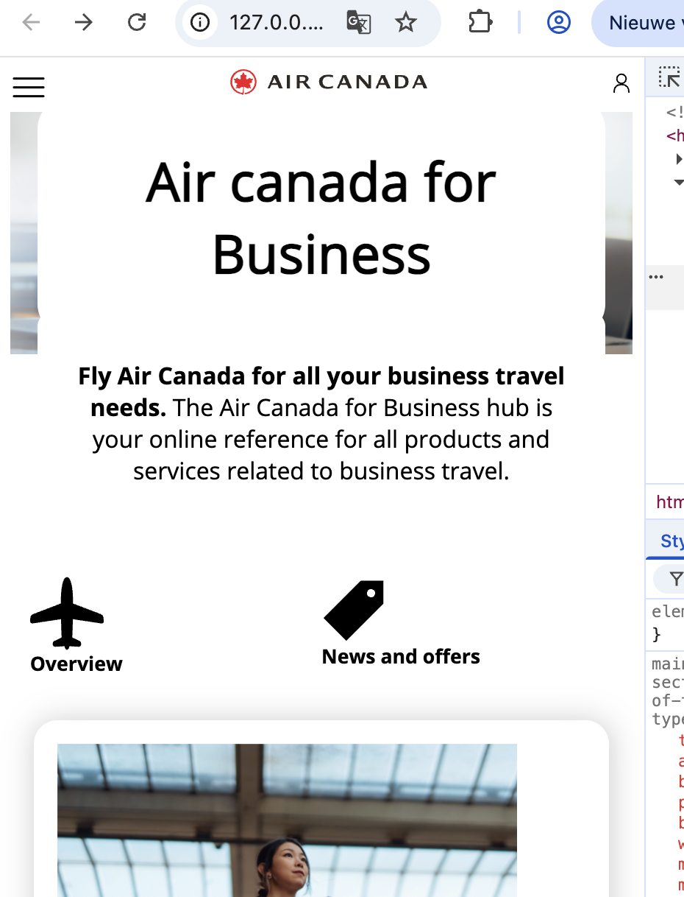
  
  Zo perfect lukte het mij niet om de header te maken. Ik probeerdere allemaal verschillende dingen maar het lukte niet. ik wou een div gebruiken maar ik wou niet die risico nemen.
  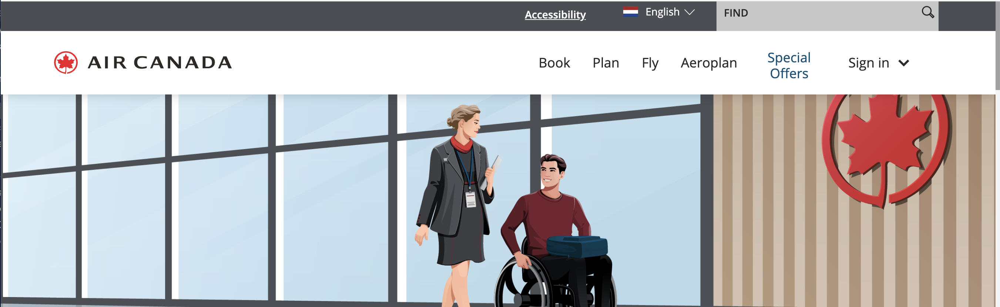
    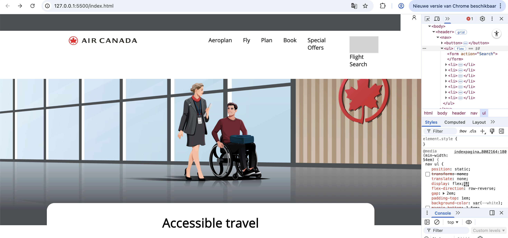

Ik wou de laaste section naast de eerste section doen (sections ozonder divs). Het was gelukt, maar je kon de een na laaste section niet meer op beeld zien. De zwarte achtergrond wou niet op die komen omdat de laatste section erboven is.
  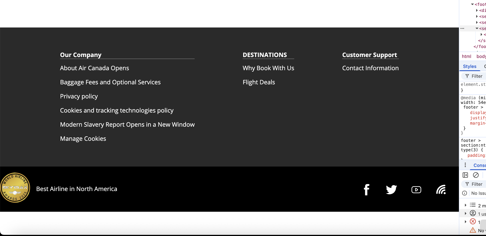

voor de micro interactie heb iik zelf paar dingen geprobeerd, alleen lukte het niet, ik wou een icoon op het scherm toevoegen. ik probeerde een tutorial video onlinen en dat werkte ook niet. ik vroeg chatgpt wat er fout was aan mijn code maar ik kwam daar niet ver mee. uiteindelijk heb ik chatgpt gevraagd voor een code een soort gelijke code. werkte niet. ik paste de code aan en voegde dingen toe in mijn html. niks werkte. ik besloot iets anders te doen dan een laadscherm. iets met de linken voor als je erop klikt. chatgpt gaf mij een code die werkt. ik wijzigde deze aan naar mijn voorkeuren en voegde een twee link erbij zodat er twee werken.
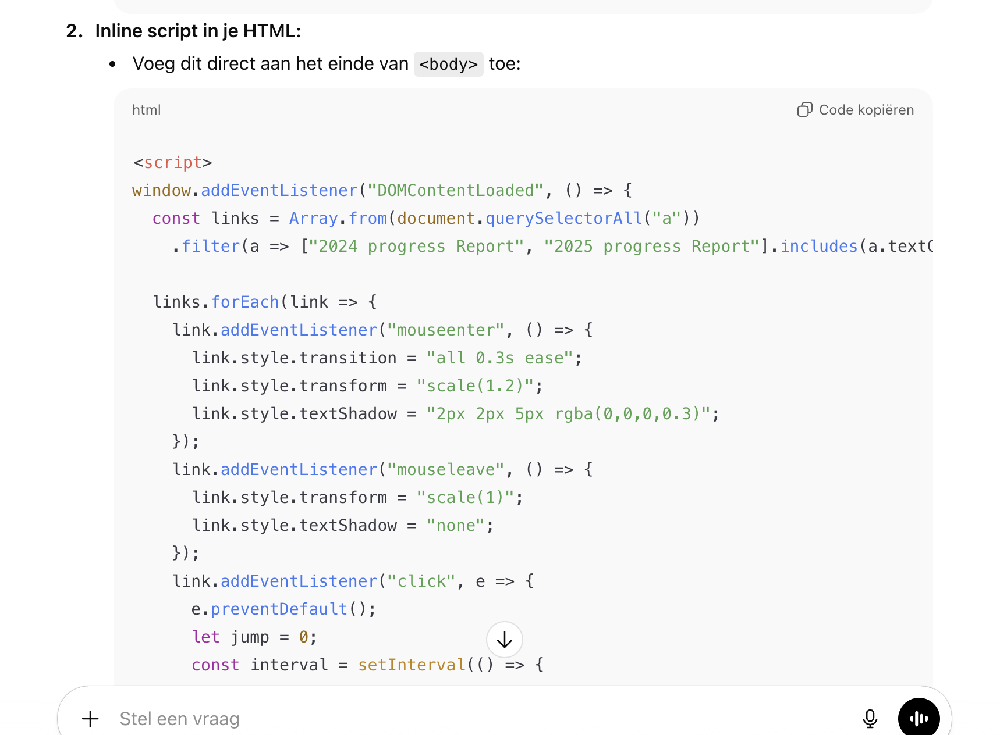

  ### Agenda voor meeting
Omra:
- hoe krijg ik de carousel vakjes even groot?
- Hoe maak ik een border line langer?
- hoe verwijder ik onnodige witruimte bij de P

Yenthe:
- hoe gaat het scrollen bij mijn carousel weg? 
 - Hoe maak ik ruimte aan de linker en rechter kan van de 4 list items (header)? 
 - Grid in footer werkt niet?

 Arpine:
  - kan een h3 en img ook als een link gemaakt worden 
  - hoe doe je het dan positioneren

Laura:
  - Het verwijderen van een element uit de DOM met js lukt me niet goed om responsive te maken.
  - Ik heb 2 divs gebruikt voor makkelijke opmaak, hoe kan ik dit op een betere manier doen?
  - Hoe download ik de svg code naar een img?

  ### Verslag van meeting
- Voor de carousel hebben ze een link van een website gestuurd, dat mij kan helpen ermee.
 - De borderline is niet lnager geworden maar er is een standaard zwarte onder erbij gekomen boven op de ene border die ik al heb.
 - De onnodige witruimte lag niet aan de p, maar een te grote svg. ik heb deze veranderd naar een andere. 

In dit gesprek vroeg ik ook hoe ik mijn begin foto's de goeie grote kan geven als ik responsive maak. Ze zaten te twijfelen met wat ik kon doen. Ik zei of ik zonodig de foto ga bewerken en die dan bij @media toevoeg. Ik kon dit gaan proberen. Er was mij ook een link gestuurd voor de fotos maar dat hielp niet. Zoals ik eerder zei had ik de picture element gebruikt die Yenthe ook gebruikte. Dit was de beste optie voor mijn probleem.

  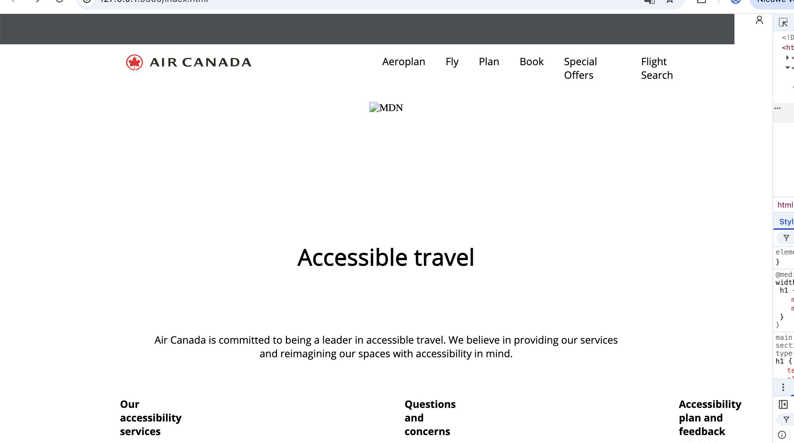

## Eindgesprek (week 5)

  
uitwerken voor eindgesprek

  ### Je uitkomst - karakteristiek screenshots:
  

  ### Dit ging goed/Heb ik geleerd: 
  Het toevoegen van grid en het gebruiken van custom properties waren nieuwe dingen die ik heb geleerd. allebei waren heel erg handig en fijn om te gebruiken. ik wil in de toekoemst dit vaker gebruiker en beter in worden

  ### Dit was lastig/Is niet gelukt:
  de micro interactie was lastig. het bleef maar niet lukken op javascript. de hamburger menu deed ik heel lang over omdat die ook elke keer niet werkte. Grid blijft nog steeds lastig. het is een fijne methode maar ik moet nog veel ermee oefenen. het ging lastig om ze precies te gebruiken zoals op de originele website

  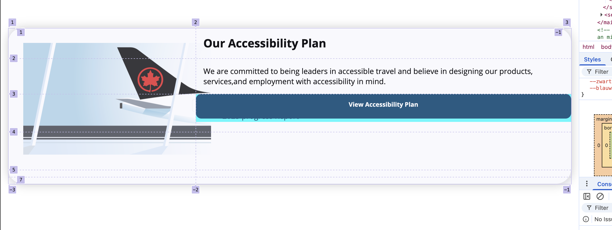

## Bronnenlijst

  
continu bijhouden terwijl je werkt

  Nb. Wees specifiek ('css-tricks' als bron is bijv. niet specifiek genoeg). 
  Nb. ChatGpT en andere AI horen er ook bij.
  Nb. Vermeld de bronnen ook in je code.

  1. chatgpt
  2. https://youtu.be/lwbh6TesXMU?si=Tfz_pdo1AuIlYnUR ( voor javascript micro interactie)
  3. 

